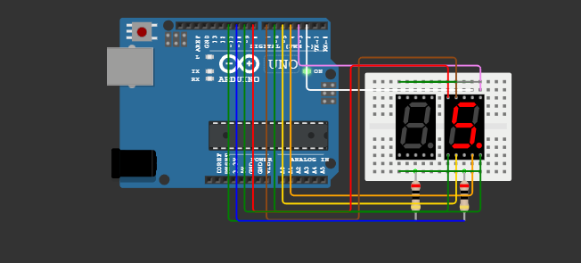

# Two-Digit-Number
This project extends the previous exercise by using two separate 7-segment LEDs to display numbers from 00 to 20, looping back to 00 after reaching 20. The display updates every one second.
